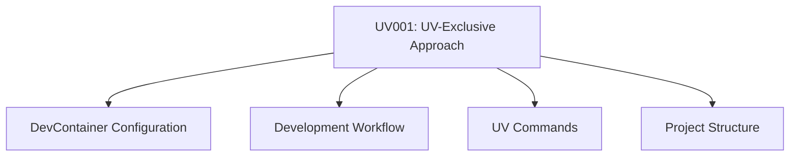

# Decision Record Index

## Purpose
This document serves as an index of all key decisions made for the project, providing a centralized registry for easy reference and navigation.

## Classification
- **Domain:** Documentation
- **Stability:** Dynamic
- **Abstraction:** Structural
- **Confidence:** Established

## Content

### Decision Records

| ID | Title | Status | Date | Domain | Summary |
|----|-------|--------|------|--------|---------|
| UV001 | UV-Exclusive Approach | Accepted | 2025-05-19 | Development Environment | Decision to use UV exclusively for Python package and environment management, deliberately blocking access to traditional Python tools |

### Decision Status Legend

- **Proposed**: A decision that is under consideration but not yet accepted
- **Accepted**: A decision that has been accepted and is currently in effect
- **Deprecated**: A decision that is no longer recommended but still in effect
- **Superseded**: A decision that has been replaced by a newer decision

### Decision Categories

#### By Domain

- **Development Environment**: [UV001]
- **Package Management**: [UV001]
- **Python Development**: [UV001]

#### By Status
- **Proposed**: []
- **Accepted**: [UV001]
- **Deprecated**: []
- **Superseded**: []

### Decision Relationships

## Relationships
- **Parent Nodes:** [foundation/structure.md]
- **Child Nodes:** [All individual decision records]
- **Related Nodes:** 
  - [processes/creation.md] - relates-to - Creation processes affected by decisions
  - [foundation/principles.md] - implements - Decisions implement project principles

## Navigation Guidance
- **Access Context:** Use this document when looking for specific key decisions or understanding decision history
- **Common Next Steps:** From here, navigate to specific decision records of interest
- **Related Tasks:** Project review, onboarding new team members, planning new work, understanding rationale
- **Update Patterns:** This index should be updated whenever a new decision is added or a decision status changes

## Metadata
- **Created:** 2025-05-19
- **Last Updated:** 2025-05-19
- **Updated By:** Claude

## Change History
- 2025-05-19: Initial creation of decision index
- 2025-05-19: Added UV001 - UV-Exclusive Approach decision
