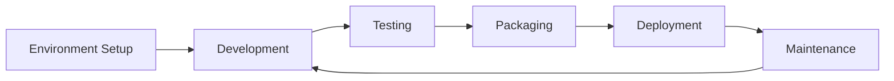

# UV Python Development Workflow

## Purpose
This document outlines the development workflows for UV Python projects, including common tasks, commands, and best practices.

## Classification
- **Domain:** Development Process
- **Stability:** Semi-stable
- **Abstraction:** Detailed
- **Confidence:** Established

## Content

### Development Lifecycle Overview

The UV Python development workflow follows these general phases:



### Environment Setup

#### Initial Project Setup

To set up a new UV Python project:

1. **Clone the template repository**:
   ```bash
   git clone https://github.com/example/uv-python-template.git my-project
   cd my-project
   ```

2. **Open in VS Code with Dev Containers**:
   - Open VS Code
   - Install the Dev Containers extension if not already installed
   - Open the project folder
   - When prompted, click "Reopen in Container"
   - The container will build and set up the UV environment automatically

3. **Verify the setup**:
   ```bash
   uv --version
   ```

#### Working with Existing Projects

To work with an existing UV Python project:

1. **Clone the repository**:
   ```bash
   git clone https://github.com/example/existing-project.git
   cd existing-project
   ```

2. **Open in VS Code with Dev Containers**:
   - Follow the same steps as for a new project
   - The container will build and set up the UV environment

3. **Create a virtual environment and install dependencies**:
   ```bash
   uv venv
   uv pip sync
   ```

### Development Workflow

#### Adding Dependencies

To add a new dependency to the project:

1. **Add the dependency to pyproject.toml**:
   ```toml
   [project]
   # ...
   dependencies = [
       # Existing dependencies...
       "new-package>=1.0.0",
   ]
   ```

2. **Install the dependency**:
   ```bash
   uv pip sync
   ```

#### Adding Development Dependencies

For dependencies only needed during development:

1. **Add to optional-dependencies in pyproject.toml**:
   ```toml
   [project.optional-dependencies]
   dev = [
       # Existing dev dependencies...
       "pytest>=7.0.0",
       "black>=23.0.0",
   ]
   ```

2. **Install development dependencies**:
   ```bash
   uv pip install -e ".[dev]"
   ```

#### Running Python Code

To run Python code in the UV environment:

1. **Run a Python file**:
   ```bash
   uv run script.py
   ```

2. **Run with arguments**:
   ```bash
   uv run script.py arg1 arg2
   ```

3. **Run a module**:
   ```bash
   uv run -m package.module
   ```

4. **Run an interactive Python session**:
   ```bash
   uv run
   ```

#### Testing

To run tests in the UV environment:

1. **Run all tests with pytest**:
   ```bash
   uv run -m pytest
   ```

2. **Run specific tests**:
   ```bash
   uv run -m pytest tests/test_specific.py
   ```

3. **Run with coverage**:
   ```bash
   uv run -m pytest --cov=src
   ```

#### Code Formatting and Linting

To maintain code quality:

1. **Format code with black**:
   ```bash
   uv run -m black src tests
   ```

2. **Lint with ruff**:
   ```bash
   uv run -m ruff check src tests
   ```

3. **Type check with mypy**:
   ```bash
   uv run -m mypy src
   ```

### Package Management

#### Creating a Lockfile

To create a lockfile for reproducible builds:

```bash
uv pip compile pyproject.toml -o requirements.lock
```

For development dependencies:

```bash
uv pip compile pyproject.toml --extra=dev -o dev-requirements.lock
```

#### Syncing from Lockfile

To install dependencies from a lockfile:

```bash
uv pip sync requirements.lock dev-requirements.lock
```

#### Building the Package

To build the package for distribution:

```bash
uv run -m build
```

This creates distribution files in the `dist/` directory.

### Python Version Management

#### Installing a Different Python Version

To install a different Python version:

```bash
uv python install 3.11
```

#### Using a Specific Python Version

To create a virtual environment with a specific Python version:

```bash
uv venv --python 3.11
```

### Common Workflows

#### Starting a New Feature

1. Create a new branch:
   ```bash
   git checkout -b feature/new-feature
   ```

2. Ensure dependencies are up to date:
   ```bash
   uv pip sync
   ```

3. Implement the feature in the `src/` directory

4. Write tests in the `tests/` directory

5. Run tests:
   ```bash
   uv run -m pytest
   ```

6. Format and lint code:
   ```bash
   uv run -m black src tests
   uv run -m ruff check src tests
   ```

7. Commit and push changes

#### Updating Dependencies

1. Update version constraints in pyproject.toml

2. Update lockfile:
   ```bash
   uv pip compile pyproject.toml -o requirements.lock
   uv pip compile pyproject.toml --extra=dev -o dev-requirements.lock
   ```

3. Sync dependencies:
   ```bash
   uv pip sync requirements.lock dev-requirements.lock
   ```

4. Run tests to ensure compatibility:
   ```bash
   uv run -m pytest
   ```

### Best Practices

1. **Always use pyproject.toml**: Keep all project configuration in pyproject.toml rather than creating separate configuration files when possible.

2. **Use lockfiles**: Generate and commit lockfiles to ensure reproducible builds.

3. **Run through UV**: Always run Python code and tools through UV (`uv run`) rather than directly.

4. **Follow src-layout**: Keep all package code in the `src/` directory.

5. **Separate dev dependencies**: Use optional-dependencies for development tools.

6. **Document UV commands**: Include common UV commands in your project's README.md.

7. **Automate common tasks**: Consider creating scripts for common tasks, but ensure they use UV commands internally.

## Relationships
- **Parent Nodes:** [elements/uv-python/overview.md]
- **Child Nodes:** None
- **Related Nodes:** 
  - [elements/uv-python/structure.md] - uses - Workflow operates on this structure
  - [elements/uv-python/devcontainer.md] - depends-on - Workflow relies on this environment
  - [elements/uv-python/commands.md] - details - Specific commands used in workflows

## Navigation Guidance
- **Access Context:** Use this document when performing development tasks in a UV Python project
- **Common Next Steps:** After reviewing workflows, explore commands.md for specific command details
- **Related Tasks:** Project development, testing, dependency management, packaging
- **Update Patterns:** This document should be updated when UV capabilities or best practices evolve

## Metadata
- **Created:** 2025-05-19
- **Last Updated:** 2025-05-19
- **Updated By:** Claude

## Change History
- 2025-05-19: Initial creation of UV Python workflow documentation
