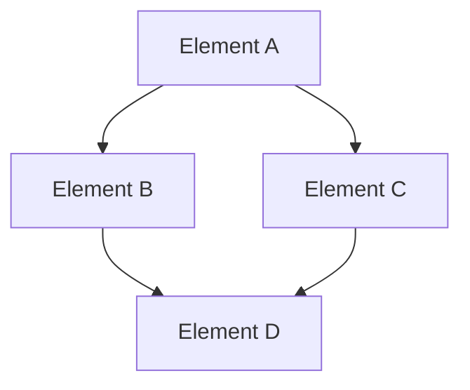

# Project Structure

## Purpose
This document provides an overview of the project structure, including key elements, their relationships, and the principles guiding their design.

## Classification
- **Domain:** Structure
- **Stability:** Semi-stable
- **Abstraction:** Structural
- **Confidence:** Established

## Content

### Structure Overview

[Provide a high-level description of the project structure, including its major elements and their relationships]

### Key Elements

#### [Element A]
[Description of Element A, its purpose, responsibilities, and key characteristics]

#### [Element B]
[Description of Element B, its purpose, responsibilities, and key characteristics]

#### [Element C]
[Description of Element C, its purpose, responsibilities, and key characteristics]

#### [Element D]
[Description of Element D, its purpose, responsibilities, and key characteristics]

### Element Interactions

[Describe how the elements interact with each other, including key interfaces, information flows, and dependencies]

### Tools and Methods

| Area | Tools/Methods | Justification |
|-------|--------------|---------------|
| [Area 1] | [Tools/Methods] | [Justification] |
| [Area 2] | [Tools/Methods] | [Justification] |
| [Area 3] | [Tools/Methods] | [Justification] |
| [Area 4] | [Tools/Methods] | [Justification] |
| [Area 5] | [Tools/Methods] | [Justification] |

### Success Criteria

#### Quality
[Description of quality requirements and how the structure addresses them]

#### Scalability
[Description of scalability requirements and how the structure addresses them]

#### Security
[Description of security requirements and how the structure addresses them]

#### Reliability
[Description of reliability requirements and how the structure addresses them]

#### Maintainability
[Description of maintainability requirements and how the structure addresses them]

### Implementation Approach

[Description of how the project will be implemented, including phases, environments, and processes]

### Future Evolution

[Description of how the structure is expected to evolve over time, including planned changes and growth areas]

## Relationships
- **Parent Nodes:** [foundation/project_definition.md]
- **Child Nodes:** 
  - [elements/*/structure.md] - details - Element-specific structural details
  - [decisions/*] - justifies - Key decisions that shaped this structure
- **Related Nodes:** 
  - [foundation/principles.md] - guides - Principles that guided structural decisions
  - [connections/dependencies.md] - details - Dependencies between elements
  - [connections/interfaces.md] - specifies - Interfaces between elements

## Navigation Guidance
- **Access Context:** Use this document when needing to understand the overall project structure and design
- **Common Next Steps:** After reviewing this structure, typically explore specific element structures or decision records
- **Related Tasks:** Project design, element development, integration planning
- **Update Patterns:** This document should be updated when there are significant changes to the project structure or methodology

## Metadata
- **Created:** [Date]
- **Last Updated:** [Date]
- **Updated By:** [Role/Agent]

## Change History
- [Date]: Initial creation of structure document
