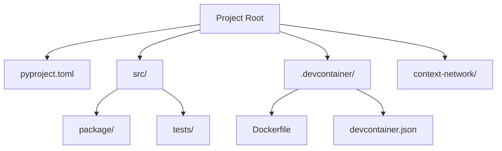
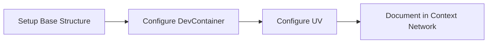

# Project Structure

## Purpose
This document provides an overview of the UV Python project structure, including key elements, their relationships, and the principles guiding their design.

## Classification
- **Domain:** Structure
- **Stability:** Semi-stable
- **Abstraction:** Structural
- **Confidence:** Established

## Content

### Structure Overview

The UV Python Project Template follows a modern Python project structure optimized for development with the UV package manager. The structure is designed to enforce UV-only workflows while maintaining compatibility with standard Python project conventions.

### Key Elements

#### Project Root
The root directory contains the main configuration files and serves as the entry point to the project structure.

#### pyproject.toml
The central configuration file for the Python project, following PEP 621 standards. This file defines project metadata, dependencies, and UV-specific configurations.

#### src/ Directory
Contains the actual Python source code organized in a package structure, following the src-layout pattern which is considered a best practice for Python projects.

#### .devcontainer/ Directory
Contains configuration files for the development container that enforces UV-only usage:
- Dockerfile: Custom container definition that installs UV and deliberately prevents access to traditional Python tools
- devcontainer.json: Configuration for VS Code's development container feature

#### context-network/ Directory
Contains all planning documents, architectural decisions, and design discussions for the project.

### Element Interactions

The project structure is designed to enforce a specific workflow:

1. The development container provides an isolated environment where only UV commands are available
2. The pyproject.toml file defines the project's dependencies and configuration
3. The src directory contains the actual Python code following modern packaging practices
4. The context network provides documentation and planning information

### Tools and Methods

| Area | Tools/Methods | Justification |
|-------|--------------|---------------|
| Package Management | UV | High-performance Rust-based package manager that replaces pip, pip-tools, and virtualenv |
| Development Environment | DevContainers | Provides consistent, isolated development environment that can enforce UV-only usage |
| Project Configuration | pyproject.toml | Modern, standardized configuration following PEP 621 |
| Code Organization | src-layout | Separates package code from project files, prevents accidental imports from project root |
| Documentation | Context Network | Separates planning/architecture documents from implementation files |

### Success Criteria

#### Quality
The structure promotes quality by enforcing modern Python packaging standards and preventing mixed tooling approaches that can lead to inconsistencies. The UV-only approach ensures deterministic builds and dependency resolution.

#### Scalability
The structure is designed to scale from small projects to larger applications. The src-layout pattern supports growth by providing clear separation between package code and project files.

#### Security
By using UV's deterministic dependency resolution and preventing access to traditional Python tools, the structure reduces the risk of supply chain attacks and dependency confusion issues.

#### Reliability
The containerized development environment ensures consistent behavior across different development machines. UV's lockfile approach ensures reproducible builds.

#### Maintainability
The clear separation of concerns (code, configuration, documentation) makes the project easier to maintain. The context network provides a structured approach to documenting architectural decisions.

### Implementation Approach

The UV Python project template is implemented as a base repository that users can clone or use as a template for their own projects. The implementation follows these phases:

### Future Evolution

The structure is expected to evolve as UV matures and adds new features. Potential areas for evolution include:

1. Integration with UV's upcoming features like `uv add/remove` commands
2. Enhanced DevContainer configurations for different development scenarios
3. Additional tooling for testing, linting, and CI/CD that leverages UV
4. Expanded context network documentation as best practices emerge

## Relationships
- **Parent Nodes:** [foundation/project_definition.md]
- **Child Nodes:** 
  - [elements/uv-python/structure.md] - details - UV Python specific structural details
  - [decisions/uv_exclusive_approach.md] - justifies - Decision to use UV exclusively
- **Related Nodes:** 
  - [foundation/principles.md] - guides - Principles that guided structural decisions
  - [connections/dependencies.md] - details - Dependencies between elements
  - [connections/interfaces.md] - specifies - Interfaces between elements
  - [elements/uv-python/devcontainer.md] - implements - DevContainer configuration details

## Navigation Guidance
- **Access Context:** Use this document when needing to understand the overall UV Python project structure and design
- **Common Next Steps:** After reviewing this structure, explore the UV Python element documentation or decision records
- **Related Tasks:** Python project setup, dependency configuration, development environment setup
- **Update Patterns:** This document should be updated when there are significant changes to UV capabilities or best practices

## Metadata
- **Created:** 2025-05-19
- **Last Updated:** 2025-05-19
- **Updated By:** Claude

## Change History
- 2025-05-19: Updated structure document to reflect UV Python template specifics
